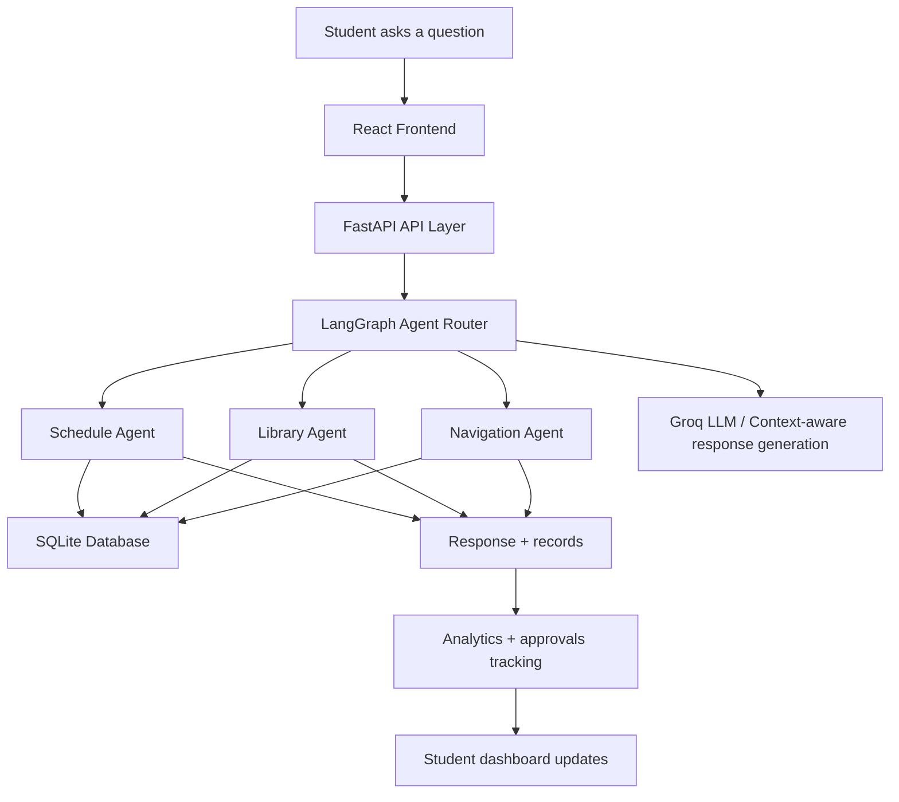

# Smart Campus Multi-Agent System

A full-stack AI assistant designed to help students manage campus life through one natural-language interface. Instead of switching between separate tools for schedules, library services, and directions, students can ask one assistant to handle everything in a single conversation.

## Why this project matters

Campus services are often fragmented across different systems:

- class schedules live in one place
- library catalogs and reservations are another workflow
- campus directions and building information are separate tools
- reminders and approvals are handled manually

This creates friction, slows down decisions, and makes the student experience feel disconnected. This project solves that by coordinating specialized AI agents behind a single conversational assistant.

## Problem statement

Students often spend unnecessary time navigating multiple campus systems to complete routine tasks such as:

- checking the next class or weekly timetable
- searching for library books or requesting a reservation
- finding directions to a classroom, lab, or building
- setting reminders for upcoming classes
- requesting approvals for library and service actions

These tasks are simple individually, but they are fragmented across different interfaces. The result is context switching, reduced productivity, and a weaker digital campus experience.

This project addresses that fragmentation by building a multi-agent AI system that routes user intent to specialized agents, retrieves the right information, and delivers a unified response.

## Solution overview

The Smart Campus Assistant brings together three specialized agents:

- Schedule agent: answers class-related questions and supports reminder workflows
- Library agent: searches the campus catalog and handles reservation/renewal requests
- Navigation agent: finds campus locations and provides route guidance from a preferred starting point

These agents are orchestrated through a single conversational flow, making the experience feel like one smart campus concierge rather than a collection of disjoint tools.

## Project highlights

- Multi-agent architecture for intent-based task routing
- Natural language campus assistant using LLM-powered classification and response generation
- FastAPI backend with structured endpoints for chat, scheduling, approvals, and analytics
- React frontend tailored for a polished student-facing campus dashboard
- Persistent student preferences such as home location and reminder timing
- Built-in approval workflow for library-related requests
- SQLite-backed data model for course, catalog, and campus metadata

## Workflow / project architecture



## How the system works

1. A student sends a message from the frontend chat interface.
2. The backend receives the request through FastAPI.
3. The query is classified into one of the supported intents: schedule, library, navigation, or unclear.
4. A specialized agent executes the appropriate logic using campus data.
5. The response generator turns the retrieved data into a clear student-facing answer.
6. The interaction is logged for analytics, and library actions can trigger approval flows.

## Tech stack

- Frontend: React, Vite, CSS
- Backend: Python, FastAPI
- Agent orchestration: LangGraph
- AI integration: Groq LLM
- Data layer: SQLite
- API validation: Pydantic

## Project structure

```text
Smart-Campus-Multi-Agent-System/
├── README.md
├── requirements.txt
├── backend/
│   ├── agents.py
│   ├── database.py
│   ├── main.py
│   └── test_agents.py
├── frontend/
│   ├── index.html
│   ├── package.json
│   ├── vite.config.js
│   └── src/
│       ├── App.jsx
│       ├── main.jsx
│       └── styles.css
└── smart-campus-multi-agent-system.md
```

## Key capabilities

### Campus scheduling assistant
- Answers questions about upcoming classes
- Displays weekly timetable information
- Sets reminder notifications before a class starts

### Library assistant
- Searches books from the campus catalog
- Identifies relevant titles and author details
- Supports reservation and extension requests through approval flow

### Navigation assistant
- Finds campus locations and landmarks
- Provides route-based guidance from a preferred start location
- Helps students navigate to rooms, buildings, and common facilities

## Why this is strong for a portfolio / recruiter showcase

This project demonstrates practical software engineering skills beyond a simple demo:

- end-to-end product thinking from front-end to AI backend
- multi-agent workflow design and orchestration
- integration of LLMs with deterministic business logic
- full-stack architecture with API design and data persistence
- user experience design for real-world student workflows
- ability to solve a concrete problem with a unified AI interface

For recruiters and hiring managers, it showcases the ability to build an AI-powered application that combines UX, backend services, orchestration logic, and enterprise-style workflow thinking in a single project.

## Setup and run locally

### 1. Backend

```bash
pip install -r requirements.txt
python -m uvicorn backend.main:app --reload --port 8000
```

### 2. Frontend

```bash
cd frontend
npm install
npm run dev
```

Then open the frontend URL shown by Vite, typically http://localhost:5173.

## Future enhancements

- real campus data integration with ERP or student system APIs
- real-time location-aware routing
- authentication for individual students
- multi-language support for international campus users
- more specialized agents for finance, housing, advising, and events

## Conclusion

The Smart Campus Multi-Agent System is a practical AI product concept that turns fragmented campus services into a single, intelligent experience. It blends conversational AI, structured data workflows, and user-centered product design into a portfolio-ready project that demonstrates both technical depth and real-world impact.
