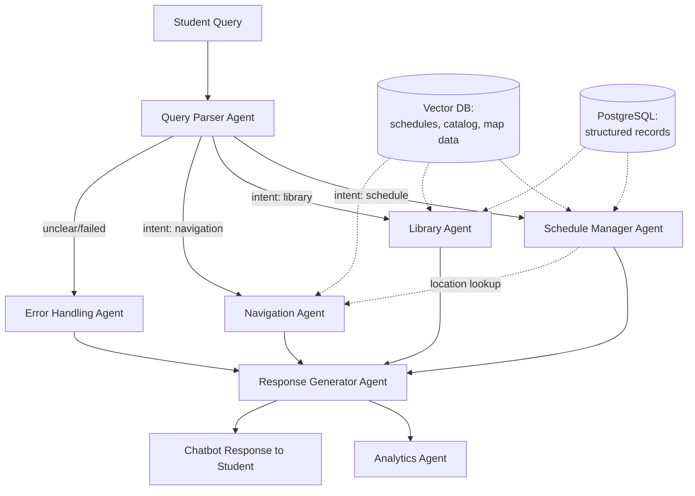
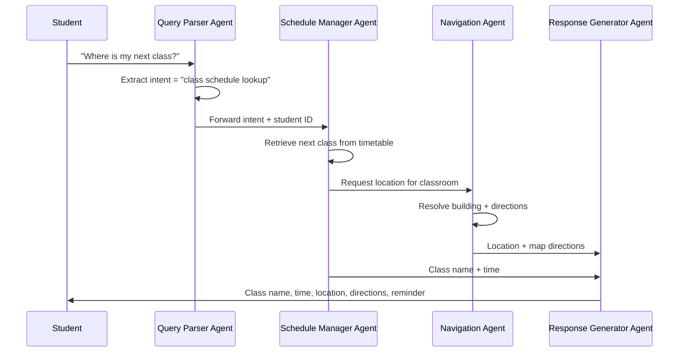

# Smart Campus Assistant — Multi-Agent System

## 1. Problem Statement

Students today interact with campus services — class schedules, library systems, and navigation — through separate, disconnected tools. This fragmentation creates friction: a student might check one app for their timetable, another to reserve a library book, and a third (or a paper map) to find a classroom.

This project addresses that fragmentation by building a **multi-agent AI system** that coordinates specialized agents behind a single conversational interface.

**Benefits:**
- **Time savings** — one interface replaces three or more disconnected tools
- **Cost reduction** — automation of routine, repetitive service requests
- **Improved student satisfaction** — faster, more natural access to campus services

---

## 2. Recommended Tech Stack

| Layer | Technology | Purpose |
|---|---|---|
| Agent orchestration | **LangGraph** | Coordinates agent state, routing, and handoffs |
| LLM inference | **Groq LLMs** | Fast natural language understanding and generation |
| Vector database | **Weaviate / Pinecone** | Embeddings for course schedules, library catalog, campus map data |
| Backend | **FastAPI** | Service layer connecting agents, DB, and frontend |
| Frontend | **React / Next.js** | Student-facing chatbot interface |
| Navigation | **Google Maps API / Campus GIS API** | Turn-by-turn directions on campus |
| Structured storage | **PostgreSQL** | Class schedules, library records, user accounts |

---

## 3. Agent Architecture

### Core Agents

| Agent | Role |
|---|---|
| **Query Parser Agent** | Extracts structured intent and entities from natural-language student queries |
| **Schedule Manager Agent** | Handles class timetables, reminders, and scheduling conflicts |
| **Library Agent** | Processes book search, reservation, and return requests |
| **Navigation Agent** | Provides directions to classrooms, labs, and campus facilities |
| **Response Generator Agent** | Formats and unifies results from other agents into a single chatbot reply |

### Optional Supporting Agents

| Agent | Role |
|---|---|
| **Error Handling Agent** | Manages unavailable data, API timeouts, or failed lookups gracefully |
| **Analytics Agent** | Tracks usage patterns for campus administration and reporting |

### Agent Interaction Diagram

---

## 4. Advanced Engineering Patterns

- **Human-in-the-loop** — Staff can override or approve schedule changes and library exceptions (e.g., extending a loan, resolving a scheduling conflict) before the agent finalizes an action.
- **Memory management** — Persist student preferences across sessions (favorite study spots, preferred class times, frequently requested routes) to personalize future interactions.
- **Self-reflection loop** — Before returning a response, agents validate that the result actually matches the parsed intent, reducing mismatched or incomplete answers.
- **RAG (Retrieval-Augmented Generation)** — Vector DB enables fuzzy matching, so "intro to comp sci" correctly resolves to "Introduction to Computer Science," and partial book titles still find the right catalog entry.

---

## 5. Example Workflow

**Student query:** *"Where is my next class?"*

**Response elements:**
1. Class name & time
2. Location with map directions
3. Optional reminder (e.g., "Set a reminder 10 minutes before?")

---

## 6. Suggested Next Steps

1. Define the LangGraph state schema shared across agents (student ID, parsed intent, retrieved data, response draft).
2. Stand up the vector DB with seed data for one department's course catalog and library shelf as a proof of concept.
3. Build the Query Parser Agent first, since every other agent depends on its output.
4. Wire a minimal FastAPI endpoint + React chat UI to test end-to-end with mocked schedule/library data before integrating real APIs.
5. Add the Error Handling Agent early — it's easier to design failure paths before agents are load-bearing than to retrofit them later.
